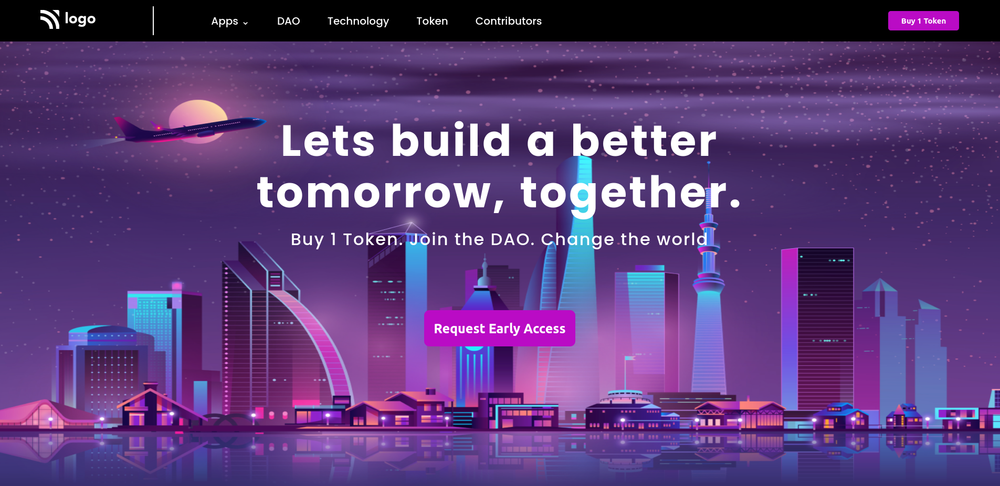

# Project - 5 DOA | Token access

This is the fifth mini-challenge project among the 15 Ineruron-projects.

## Table of contents

- [Overview](#overview)
  - [Screenshot](#screenshot)
  - [Links](#links)
- [My process](#my-process)
  - [Built with](#built-with)
  - [Time required](#time-required)
  - [What I learned](#continues-development)
  - [Useful resources](#useful-resources)
- [Author](#author)
- [Acknowledgments](#acknowledgments)

## Overview

### Screenshot



### Links

- Code File URL: [github.com](https://github.com/Jyotimoykathar/Project-05)
- Live Site URL: [netlify.app](https://project-05-doa-token.netlify.app/)

## My Process

### Built with

- Semantic HTML5 markup
- CSS custom properties
- Flexbox Css

### Time required

It took me nearly 4 hours to complete the entire static project.

### What I learned

This is the css design code snippet of the container section, through which i got more clear on positioning of an image in a backgorund.

```css
.container {
  height: 100vh;
  background-image: url("assets/bg.png ");
  background-repeat: no-repeat;
  background-size: 100% 100%;
  background-position: center;
}
```

### Continued development

I have learned a lot on positioning of images and theres a lot more to experience with it.

### Useful resources

- [MDN](https://developer.mozilla.org/en-US/) - This website helped me to any thing i had to look upon.

## Author

- Github page- [Jyotimoykathar](https://github.com/Jyotimoykathar/)

## Acknowledgments

Special Thanks to [MDN](https://developer.mozilla.org/en-US/) website and to all the Ineuron team for the mini-challenge to test and improve my positioning skills.
